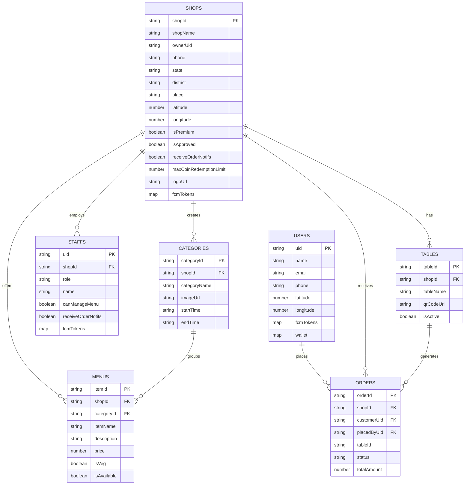

# QMBUDDY - Database Architecture (Firestore)

We follow a strictly separated top-level collection approach to ensure migration readiness. 

## Database ER Diagram
Here is the visual representation of how our collections relate to each other:

## 1. Users Collection
Stores only the end customers (users who order food).
- `users` (Collection)
  - Document ID: `uid` (from Google Auth)
  - Fields: `name`, `email`, `phone`, `latitude`, `longitude`, `fcmTokens` (Map<Token, Boolean>), `wallet` (Map of shopId to Coin balance, e.g. `{ "shopA": 50, "shopB": 120 }`), `createdAt`.

## 2. Shops Collection
Stores the shop details and precise location.
- `shops` (Collection)
  - Document ID: `shopId`
  - Fields: `shopName`, `ownerUid`, `phone`, `state`, `district`, `place`, `latitude`, `longitude`, `qrCodeUrl`, `isPremium` (boolean), `isApproved` (boolean - Super Admin control), `receiveOrderNotifs` (boolean), `maxCoinRedemptionLimit` (number, e.g., 50 for 50% max bill usage), `logoUrl`, `fcmTokens` (Map<Token, Boolean> for device-specific toggles), `createdAt`.
  
  *(Note on Monetization: If `isPremium` is false, the UserMenu screen will display the QMBUDDY logo. If true, it displays the shop's custom `logoUrl`.)*
  
## 3. Staffs Collection (Top-Level)
- `staffs` (Collection)
  - Document ID: `uid` (from Firebase Auth)
  - Fields: `shopId`, `name`, `email`, `role` (e.g., waiter, kitchen), `canManageMenu` (boolean), `receiveOrderNotifs` (boolean), `fcmTokens` (Map<Token, Boolean> for device-specific toggles), `createdAt`.

## 4. Categories Collection (Top-Level)
Stores menu categories with time slots for the **Smart Time-based Auto-Sort** feature.
- `categories` (Collection)
  - Document ID: `categoryId`
  - Fields: `shopId`, `categoryName`, `imageUrl`, `startTime` (e.g., "07:00"), `endTime` (e.g., "11:30"), `priorityIndex`.

## 5. Menu Collection (Top-Level)
- `menus` (Collection)
  - Document ID: `itemId`
  - Fields: `shopId`, `categoryId`, `itemName`, `description` (e.g., ingredients or details), `price`, `imageUrl`, `isVeg` (boolean - Veg/Non-Veg tag), `isAvailable`.

## 6. Tables / QR Codes Collection (Top-Level)
Stores the generated QR codes and table details.
- `tables` (Collection)
  - Document ID: `tableId`
  - Fields: `shopId`, `tableName` (e.g., "Table 1", "VIP 1"), `qrCodeUrl`, `isActive` (boolean to temporarily disable a table's QR), `createdAt`.

## 7. Orders Collection (Top-Level)
- `orders` (Collection)
  - Document ID: `orderId`
  - Fields: `shopId`, `customerUid` (null if walk-in), `placedByUid` (who created the order - customer or waiter), `tableId`, `items`, `totalAmount`, `status`, `timestamp`.
